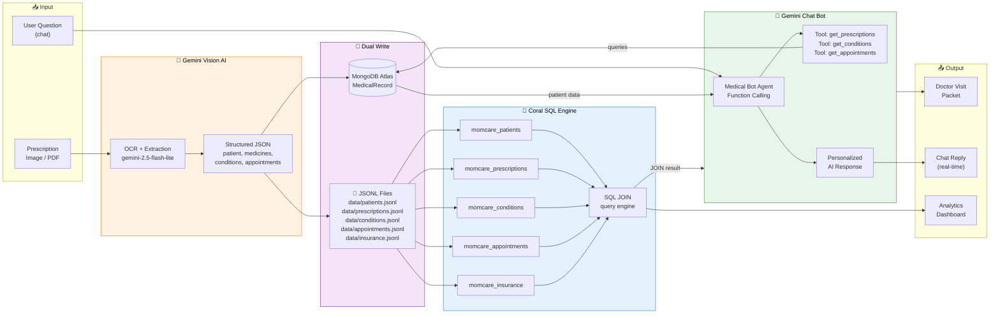
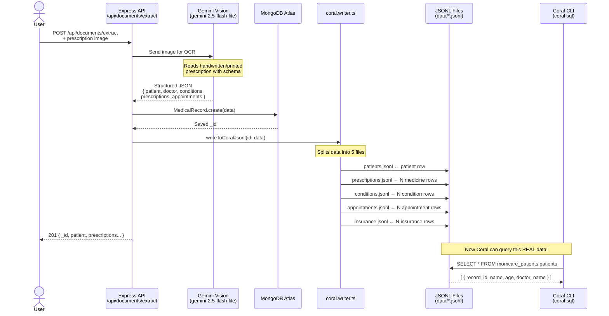
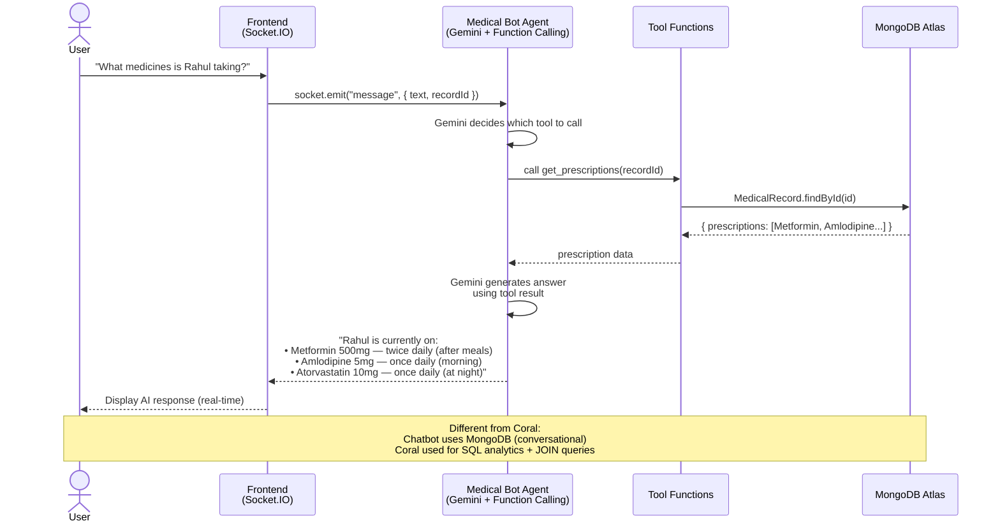
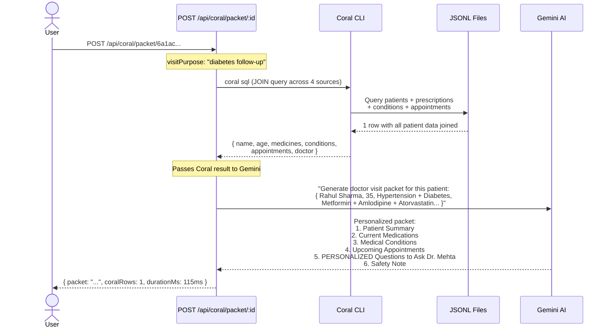
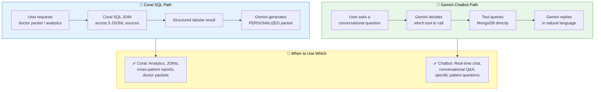

# 🪸 How Coral + Gemini Work Together in Mom-Care

---

## 1. Complete System Flow

---

## 2. Prescription Upload → Coral Data Pipeline

---

## 3. Gemini Chatbot — How It Answers Questions

---

## 4. Doctor Visit Packet — Coral + Gemini Together

---

## 5. Key Difference: Coral vs Chatbot

---

## API Quick Reference

| Endpoint | Method | What it uses | Output |
|---|---|---|---|
| `/api/documents/extract` | POST | Gemini Vision | Extracted patient data |
| `/api/coral/status` | GET | Coral CLI | Registered sources |
| `/api/coral/query` | POST | Coral SQL | Raw SQL results |
| `/api/coral/analytics` | GET | Coral SQL | Top conditions + medicines |
| `/api/coral/packet/:id` | POST | Coral SQL + Gemini AI | Doctor visit packet |
| `/api/dashboard/stats` | GET | MongoDB | Record counts |
| `/api/dashboard/system` | GET | MongoDB + Coral + Gemini | Health status |
